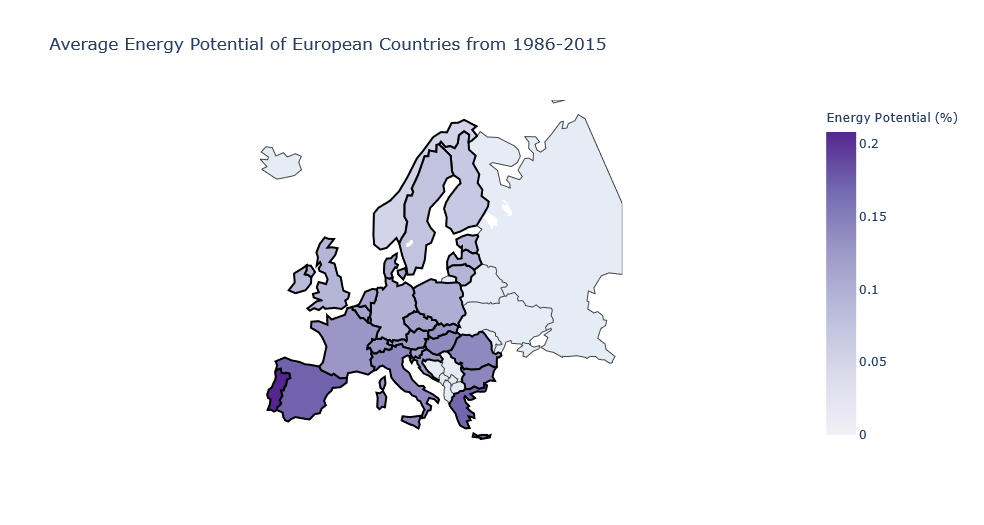

# Predicting Solar Power Generation
---

## 1. Preamble
---

Demand for energy is increasing, and is one of the main reasons for integration of **solar energy** into the electric grids or networks. Based on existing technologies, solar energy (compared to other renewable energy options) provides the greatest potential for deployment in Singapore [1].

One of the challenges with integrating solar energy, into the grid network is that its power generation is intermittent and uncontrollable. Therefore, predicting future solar power generation is important, since the grid must dispatch generators to satisfy demand as generation varies [2].

## 2. Objective
---

The project objective is to predict potential solar power generation most accurately, based on historical data. In evaluating the accuracy of models, I refer to the root mean squared error (RMSE) and the mean absolute error (MAE).

The RMSE is the root average of the total squared forecast error values. The mean squared error penalizes larger errors so when root is applied, it transforms the value back into the original units of the predictions. We want to achieve as small an RMSE value as possible as it shows that the model's predictions are closer to the true values.

The MAE is the average magnitude of errors in a set of predictions, without considering direction (ie. negative or positive). Similarly, a better model would have lower MAE.

## 3. Contents
---

01. [Data Cleaning](#Data-Cleaning)
02. [Clustering](#Clustering)
03. [Data Exploration](code/03-data-exploration.ipynb)
04. [Forecasting with linear regression/ tree algorithms/ fbprophet](code/04-modelling-forecast.ipynb)
05. [Forecasting with neural networks](code/05-modelling-neural-nets.ipynb)

## 4. Folder Organisation
---

    |__ code
    |   |__ 01-data-cleaning.ipynb   
    |   |__ 02-modelling-clustering.ipynb
    |   |__ 03-data-exploration.ipynb
    |   |__ 04-modelling-forecast.ipynb
    |   |__ 05-modelling-neural-nets.ipynb  
    |__ data
    |   |__ EMHIRES_PVGIS_TSh_CF_n2_19862015.csv
    |   |__ EMHIRESPV_TSh_CF_Country_19862015.csv
    |   |__ emhirespv_gonzalezaparicioetal2017_newtemplate_corrected_last.pdf
    |   |__ spain-energy-potential.csv
    |   |__ solar-ctry-clean.csv
    |   |__ solar-nuts-clean.csv
    |   |__ spain-energy-potential-country.csv
    |   |__ spain-energy-potential-nuts.csv
    |__ images
    |   |__ avg-solar-by-country.png
    |   |__ distortion-score.jpg
    |   |__ eda.jpg
    |__ presentation_slides
    |   |__ solar-enery-potential.pdf
    |__ README.md

## 5. Analysis and Findings
---

### 5.1 [Data Cleaning](code/01-data-cleaning.ipynb)
---

Both datasets comprise 50 years' worth of solar generation data of European countries by country and by NUTS 2 system. The values in both datasets reflect the hourly estimates of the area's solar energy potential from 1986 to 2015. The same kind of data is collected, just that the one for NUTS 2 system collect solar energy potential of different regions of a country so this dataset has more data to work with for a particular country.

A `time` column was added to both datasets to track which hours of the day would the area's energy potential be higher than others. We would expect there to be a spike in the afternoon hours. There may also be seasonality across the years, so the `month` and `week` will also be tracked.

The pandas profiling report generated for the datasets, showed the following:
- there are no missing values
- data for each country is heavily right-skewed (ie. there a lot more instances where no solar energy is generated)
- there is high correlation between the countries, which is expected since they are pretty close together, and so will have similar exposure to the sun. Based on this, I could simplify the analysis by clustering the countries, and perform analysis on just one country in each cluster.
- there are no negative values, so there is a remote likelihood of erroneous data collected

Further data exploration will be done after clustering the countries.

### 5.2 [Clustering](code/02-modelling-clustering.ipynb)
---

First I want to visualize the average energy potential of each countries across the years (Figure 1).

*Figure 1: Average Energy Potential by Country for 1968 to 2015*

We see that the regions with greater solar energy potential are at the lower regions, closer to the Equator. This makes sense since the sun's rays strike the Earth's surface most directly at the Equator. The colour gradient is also consistent from bottom up which also shows high correlation between neighbouring countries from similar levels of exposure to the sun.

I use `KMeans` to cluster the countries, and chose a range of 2 to 10 clusters. Based on this, using the elbow method and based on the distortion score, decide which is the optimal number of clusters.

Distortion score is the sum of squared distances from each point to its assigned center (ie. sum of squared errors). The elbow method seeks to identify a point as number of clusters increase, where the distortion score start to flatten, forming the elbow. This is then determined to be the ideal number of clusters for the data (Figure 2).

*Figure 2: Distortion score elbow for KMeans clusters 2 to 10*

From here, we see that 5 clusters is ideal. The elbow method mostly serves as a guide, and should be considered alongside **silhouette score**. **Silhouette score** considers both the average intra-cluster distance and average inter-cluster distance. A score close to 1 means that the clusters are well apart from each other and clearly distinguished. Figure 3 shows the the silhouette scores and distribution of data points across the clusters for 4 clusters, 5 clusters, and 6 clusters.

*Figure 3: Silhouette scores for clusters 4 to 6*

We'd want to lookout for a few things:

1. Positive silhouette coefficient values

A negative silhouette coefficient value means that the sample (in this case, the country), is better off assigned to another cluster. Based on the plots above, 6 clusters and 7 clusters are suboptimal.

2. Silhouette score for clusters above the average silhouette score

6 clusters and 7 clusters have clusters below the average silhouette score so we'll just consider 3-5 clusters.

3. Thickness of the silhouette plots

Between 3, 4 and 5 clusters, the plot with 5 clusters have a more uniform cluster thickness than the rest. Therefore, 5 clusters is probably indeed the most optimal.

Looking at the intercluster distances for clusters 4 to 6 in Figure 4, from cluster 6, there seem to be too many overlapping regions. Cluster 5 too showed some overlaps.

*Figure 4: Intercluster distance for clusters 4 to 6*

However, we bear in mind that it is not essential that we get exact distinct clusters since the purpose of clustering is mainly for eaasier analysis and would not affect prediction of solar energy potential for the countries.

Based on this, we will go forward with 5 clusters using KMeans clustering.

I applied the cluster labels, and these are the countries in the different clusters (Figure 5):

*Figure 5: Countries in respective clusters*

I then proceed to explore the data by looking at one country in each cluster :

*Figure 6: Selected country in each cluster*

### 5.3 [Data Exploration](code/03-data-exploration.ipynb)
---

Considering the voluminous data, I decided to just look at 10 years' worth of data to explore. I did a sanity check on the data points, firstly that there are no negative values, and secondly, that there are no values greater than 1 (since values are in %). None were noted. So I proceeded with the exploration.

First I look at how solar energy potential changes within a day (24 hours) (Figure 7).

*Figure 7: Hourly solar energy potential for each country*

From here, we see that :

- There is only energy potential between 0600H and about 1700H, which is daylight period. Logically, this means no energy potential during nighttime.
- **Croatia** has the highest energy potential while **Norway** and **Finland** has the lowest energy potential.
- **Spain** has the "fattest" curve, which means that it has most hours exposed to sun, compared to other countries.
- The peak across all countries here are at the noon hour.

Next I consider the distribution of solar energy potential within the daylight hours (Figure 8).

*Figure 8: Distribution of hourly solar energy potential for each country*

Based on this,

- **Norway** and **Finland**'s peak is very close to 0% energy potential. This suggests that it is not wise for these countries to rely heavily on solar energy for power.
- The rest of the countries have pretty even distribution from 0% enery potential to about 0.6%, with peaks ranging from 0.3% to 0.5% energy potential.
- Spain seems to have the most area exposed which translates to greater energy potential. This corroborates with earlier analysis where Spain has the most hours exposed to sun, compared to other countries here.

Thirdly, I look at potential seasonality over the years, since these countries have seasons (ie. summer, autumn, winter and spring). Winter has shorter daylight hours, so I would expect months that coincide with winter season would show the lowest energy potential to other parts of the year, and this pattern would repeat every year.

Using just **Spain's** data, I plot the 10-year graph of energy potential to view seasonality (Figure 9).

*Figure 9: Spain's yearly seasonality of energy potential*

We see that:

- There is obvious seasonality across the years, where there are peaks and troughs at relatively consistent times of the year.
- This consistency may make it easier for prediction models to predict solar energy generation in future.

I plot the Spain's data using the NUTS 2 dataset, and had the same seasonality trend within the year. I went to look into the trend within months of a year, to confirm the seasons for Spain, that affect energy potential (Figure 10).

*Figure 10: Spain's seasonality of energy potential, by months*

Looking at how energy potential changes within a year, for Spain, hottest months of the year are between **April to August**, during spring and summer. The coldest months (with lack of sunlight) are from **December to March**, which is winter season.

Using the NUTS dataset, we also see the same trend for different regions of Spain (Figure 11).

*Figure 11: Spain's seasonality of energy potential, by months (NUTS2 system)*

Now that we've understood the seasonality in data, I proceed to <ins>forecast solar energy potential in Spain</ins>

### 5.4 [Modelling with linear regression, tree algorithms and fbprophet](code/04-modelling-forecast.ipynb)
---

#### 5.4.1 Preprocessing

I split the data such that the last month in the dataset (ie. December 2015) will be the test set, and all 9 years 11 months earlier will be what the model will train on. December 2015 data is the holdout set, from which I will determine how well the model generalises.

#### 5.4.2 Baseline Model

Before running the data on any algorithms, I first set out the **baseline model** from which we will benchmark against how other model performs.

I determine the baseline model to be the **mean** of past solar energy potential, since this is most basic estimate.

Plotting the true values against baseline predictions (Figure 12), we see that the model does recognise seasonality but did not really identify more complex patterns.

*Figure 12: Baseline predictions against true values of test set*

Results of model based no RMSE and MAE as evaluation metrics, below :

| Model | RMSE | MAE |
| :-----: | :--: | :---: |
| Baseline | 0.0524 | 0.0258 |

#### 5.4.3 Models Considered : Linear Regression, Random Forest Regressor, K Neighbours Regressor and XG Boost Regressor.

I ran the train set on these models considered, and results of training set are tabled below :

| Model | RMSE | MAE |
| :-----: | :--: | :---: |
| Baseline | 0.0524 | 0.0258 |
| Linear Regression | 0.0532 | 0.0283 |
| Random Forest | 0.0542 | 0.0268 |
| K Neighbors | 0.0622 | 0.0313 |
| XG Boost | 0.0554 | 0.0346 |

From here, sadly, none of the models did better than baseline. The closest is linear regression. It could be that other models are too complex for forecasting with just a few features, such that linear regression did the best. It is also likely that tree regressors may not be suitable for forecasting, especially to recognise seasonality.

In view of the above results, I explored other models to try and achieve something better than baseline.

#### 5.4.4 Modelling with fbprophet

FB prophet is a powerful library and has hyperparameters that can tune seasonality, so I figured this model could probably perform much better than those considered earlier.

After tuning its hyperparameters, indeed, it did perform slightly better than earlier models.

*Figure 13: FB Prophet predictions against true values of test set*

From Figure 13 above, we see that the predictions are closer to the true values compared to baseline model. Looking at the evaluation metrics :

| Model | RMSE | MAE |
| :-----: | :--: | :---: |
| Baseline | 0.0524 | 0.0258 |
| Linear Regression | 0.0532 | 0.0283 |
| Random Forest | 0.0542 | 0.0268 |
| K Neighbors | 0.0622 | 0.0313 |
| XG Boost | 0.0554 | 0.0346 |
| FB Prophet | 0.0491 | 0.0293 |

FB Prophet had the best score amongst other models! I then try to beat that score using neural networks.

#### 5.4.5 Modelling with neural networks

First, I used a simple recurrent neural network (RNN) to predict. RNN is a class of neural networks powerful for modeling *sequence* data like time series or natural language. RNNs have a sense memory which helps in keeping track of what happened earlier in the sequential data, that helps them *gain context and identifying correlations and patterns* [3].

Running the simple RNN, it performed slightly better than fbprophet.

*Figure 14: RNN predictions against true values of test set*

While fbprophet was able to capture seasonality, it is likely that taking into consideration the solar energy potential in the previous hour is equally or more important for the model to predict.

I also attempted to predict with Long Short-Term Memory (LSTM). LSTMs includes a "memory cell" that can maintain information in memory for long periods of time. A set of gates is used to control when information enters the memory, when it's output and when it's forgotten [4].

From Figure 15, it did just slightly better than RNN, which makes sense since the model would be also be able to account for seasonality.

*Figure 15: LSTM predictions against true values of test set*

### 5.3 Conclusion and Recommendation

Here's a summary of results of predictions :

| Model | RMSE | MAE |
| :-----: | :--: | :---: |
| Baseline | 0.0524 | 0.0258 |
| Linear Regression | 0.0532 | 0.0283 |
| Random Forest | 0.0542 | 0.0268 |
| K Neighbors | 0.0622 | 0.0313 |
| XG Boost | 0.0554 | 0.0346 |
| FB Prophet | 0.0491 | 0.0293 |
| RNN | 0.0381 | 0.0197 |
| LSTM | 0.0353 | 0.0173 |

LSTM is most accurate in predicting solar energy potential and this model appear to be stable to help with more effective grid management.

Apart from effective grid management, we would also be able to predict which hours of the day where more energy is generated or where energy is least generated, and subsequently advice consumers times of the day where it's best to reduce energy consumption.

### 5.4 Further Development

While data is based on regions in Spain, it is possible to scale this upwards to states or continents.

In the local context, it is possible to measure solar irradiance in various parts of Singapore. From here, areas with most sunlight could be identified, and solar panel placement could be made more efficient.

### 5.5 Challenges and Limitations

The project has attempted to predict solar energy potential based on historical data assuming ideal conditions.

There are other uncontrollable factors that may affect solar efficiency. Factors that affect efficiency of cells include higher temperatures, cloud cover or storms, and high humidity. These present some external limitations to Singapore's ability to generate significant quantities of electricity from renewable energy sources.

## 6. Data Dictionary

Below description of the dataset, sourced from [kaggle](https://www.kaggle.com/sohier/30-years-of-european-solar-generation). The data was made available by the [European Commission's STETIS Program](https://setis.ec.europa.eu/about-setis).

| Axis | Type | Description |
| :-----: | :--: | :---------- |
| Columns | str | European Country Codes |
| Rows | float | Hourly estimates of an area's energy potential for 1986-2015 as a percentage of a power plant's maximum output |

## 7. References

[1] Energy Market Authority (EMA) "Intermittency Pricing Mechanism for Intermittent Generation Sources in the National Electricity Market of Singapore" [Online Document], 2018. https://www.ema.gov.sg/cmsmedia/Final%20Determination%20Paper%20-%20Intermittency%20Pricing%20Mechanism%20vf.pdf [Accessed: 22 April 2021]

[2] N. Sharma, P. Sharma, D. Irwin and P. Shenoy "Predicting Solar Generation from Weather Forecasts Using Machine Learning" [Online Document], 2011. http://www.ecs.umass.edu/~irwin/smartgridcomm.pdf [Accessed: 22 April 2021]

[3] K.Kohli "Recurrent Neural Networks (RNN's) and Time Series Forecasting" [Online Article], 2020. https://medium.com/analytics-vidhya/recurrent-neural-networks-rnns-and-time-series-forecasting-d9ea933426b3 [Accessed: 26 April 2021]

[4] J. Chung, C. Gulcehre, K. Cho, Y. Bengio "Empirical Evaluation of Gated Recurrent Neural Networks on Sequence Modeling" [Online Paper], 2014.
